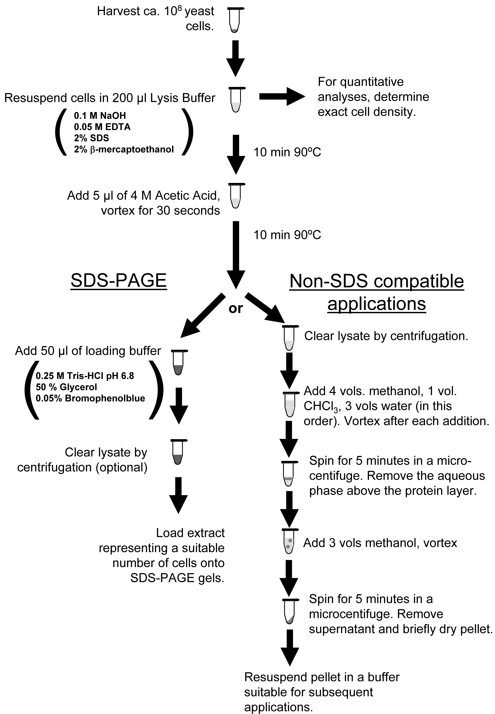

# Yeast Western Blots

### chemical protein extraction via hot hydroxide-SDS

derived from protocol described in [Optimized Protein Extraction for Quantitative Proteomics of Yeasts](https://dx.doi.org/10.1371%2Fjournal.pone.0001078)
by Tobias von der Haar

*this modification by jtourig / zentlab, current as of Apr 2021*

## Intro

I've never had much luck with bead beating to extract yeast protein; it was always inefficient even with extended shaking, and I found it cumbersome overall.
Seeking an alternative, I found this chemical extraction method from the proteomics paper cited above, as outlined in the left branch of the paper's Figure 1 below.
It relies on a short, hot hydroxide + SDS treatment to hydrolyze the cell wall and lyse the cells / solubilize protein...

Fig 1 von der Haar POne 2007

...with a few small modifications for time and volume.

## Materials

You will need:

- **NaOH-SDS Lysis Buffer** \(0.1M NaOH, 0.05M EDTA, 2% SDS\)
  - omit the stinky 2% BME reducing agent in the image - we add DTT later in the sample buffer
- **4M Acetic Acid** \(typically diluted from glacial acetic acid, which is ~17.4M\)
- **4X LDS Sample Buffer** \(Bio-Rad #1610747\)
  - or whatever sample/loading buffer you'd like \(adjust volumes as necessary\)
- **1M DTT**
- **Yeast Cells** \(1-2ml of saturated overnight culture or ~6+ OD·ml of timecourse usually yields plenty\)

## Method

0. Make sure you have a heat block turned on @ 95°C
1. Pellet, aspirate, and resuspend cells in 150µl Lysis Buffer
2. Heat @ 95°C for 5m
3. Remove from heat and neutralize with 3.75µl 4M Acetic Acid, vortex
    - this is important - if your sample buffer below turns yellow or clear, you forgot!
4. Add 50µl 4X Sample Buffer \(w/ DTT added 1:9, 100mM\), vortex
5. Heat @ 95°C for another 2m \(you can set up your gel rig during this time\)
6. CLEAR THE LYSATE - spin for 2m at maximum speed to pellet cell debris \(room temp\)
    - IMPORTANT - if your lanes are ever smeary, you might be dragging along DNA / insoluble gunk during electrophoresis
7. Load the supernatant / soluble protein fraction in the gel relative to any normalization measurements made, and proceed with the blot.

## Other Yeast Western Tips

- Make sure to check your loading and transfer, with Ponceau stain
- Most good yeast primaries work at 1:1000, and can be reused
- Use AdvanBlock-Fluor or -Chemi as blocking reagent and in primary dilution to improve sensitivity
  - I find milk tends to lower signal of yeast westerns severely
- I usually probe for primary overnight @ 4°C, and wash it once quickly with PBS, then 3x with PBS + 0.1% Tween-20, for 5m, 6m, 7m \(or just 3x over ~20m\)
- Secondaries can be used at 1:10,000 for fluorescent and 1:20-30,000+ for HRP-conjugated antibodies
  - liberally diluting the HRP secondary antibodies can help signal:noise a lot
- Use the LiCor \(fluorescent blot\) when you can - it's convenient with great dynamic range
- Sometimes you must use chemiluminescence for sensitivity \(at least with our equipment\)
  - image via a digital camera dock if you must use HRP (easy to make figures with software, good dynamic range)
  - avoid film whenever possible (cumbersome and poor dynamic range)